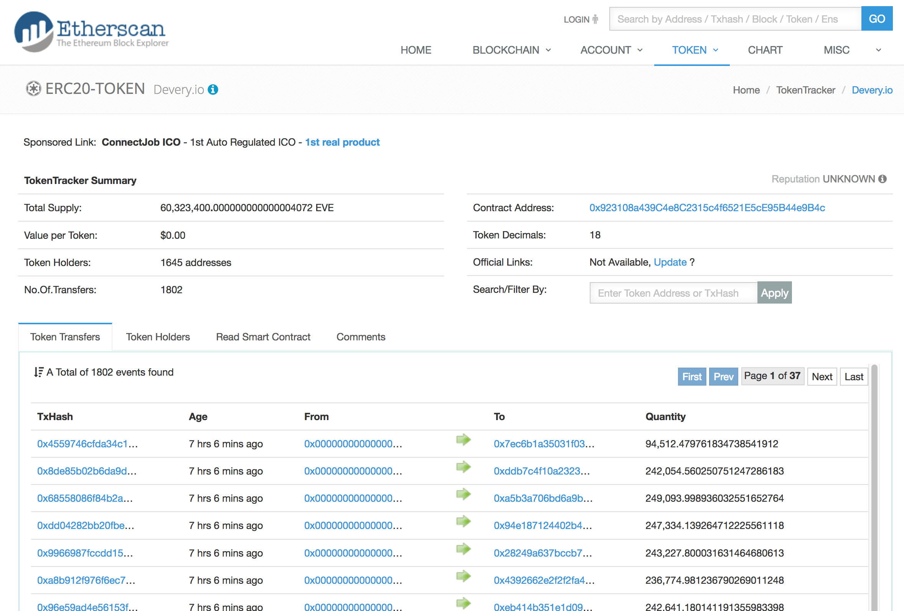
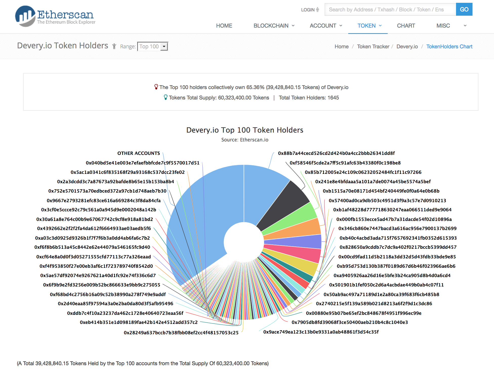

# Devery Crowdsale Contract

## Mainnet Deployment

* Crowdsale contract [0x87766C251F604163b23802C6b30DAe398F49528C](https://etherscan.io/address/0x87766C251F604163b23802C6b30DAe398F49528C#code)
* Token contract [0x923108a439C4e8C2315c4f6521E5cE95B44e9B4c](https://etherscan.io/token/0x923108a439C4e8C2315c4f6521E5cE95B44e9B4c)
* Vesting contract [0x93c625B959b55F67CDdd7bAed6eC50D1acEb3B13](https://etherscan.io/address/0x93c625B959b55F67CDdd7bAed6eC50D1acEb3B13)
* Multisig [0x87410eE93BDa2445339c9372b20BF25e138F858C](https://etherscan.io/address/0x87410eE93BDa2445339c9372b20BF25e138F858C#internaltx)
* Presale contract [0x8ca1d9C33c338520604044977be69a9AC19d6E54](https://etherscan.io/address/0x8ca1d9C33c338520604044977be69a9AC19d6E54)

<br />

<hr />

## Crowdsale Statistics

The crowdsale sold out 17 seconds after the initial 12 hour period when then was a contribution cap of 3 ETH. The last valid contribution was
[0x4559746c](https://etherscan.io/tx/0x4559746cfda34c1cf06327c0376b49ae8ccfacc9f62be4217734c04a16b09a01) for 41.863162511 ETH but 25.751796138658412009 ETH
was refunded as the cap was reached.

Following are the statistics after the crowdsale sold out, and before the team and reserve tokens have been allocated:

Individual contribution statistics can be found at [scripts/DeveryCrowdsaleSummary.json](scripts/DeveryCrowdsaleSummary.json).

From [https://etherscan.io/token/0x923108a439C4e8C2315c4f6521E5cE95B44e9B4c](https://etherscan.io/token/0x923108a439C4e8C2315c4f6521E5cE95B44e9B4c):

<kbd></kbd>

<br />

From [https://etherscan.io/token/tokenholderchart/0x923108a439C4e8C2315c4f6521E5cE95B44e9B4c](https://etherscan.io/token/tokenholderchart/0x923108a439C4e8C2315c4f6521E5cE95B44e9B4c):

<kbd></kbd>

<br />

<hr />

## Requirements
* 100 Million tokens

* Presale 5% bonus
* 20ETH max contributions for 24hrs, afterwards cap is removed - we can change this number
* PICOPS users get a bonus of 150EVE  - we can change this number
* The contract will open when date starts, this date can be in the past.
* Rejects funding at 10 million USD cap set with USD price per ETH
* Owner must call crowdsale contract to close. 1 week lockup from end of sale whether it fills or not.
* Unsold tokens are not generated.

<br />

<hr />

## Deployment And Execution

### Deploy BTTS Token Contract

* Use BTTSTokenFactory deployed on Mainnet at address https://etherscan.io/address/0x594dd662b580ca58b1186af45551f34312e91e88#code
* Execute `bttsTokenFactory.deployBTTSTokenContract(symbol, name, decimals, initialSupply, mintable, transferable)` where
  * `symbol` = `EVE`
  * `name` = `Devery`
  * `decimals` = `18`
  * `initialSupply` = `0`
  * `mintable` = `true`
  * `transferable` = `false`

The EVE tokens has been deployed to [0x923108a439C4e8C2315c4f6521E5cE95B44e9B4c](https://etherscan.io/address/0x923108a439C4e8C2315c4f6521E5cE95B44e9B4c#code).

<br />

### Deploy Devery Crowdsale Contract

* Deploy `DeveryCrowdsale.DeveryCrowdsale`

<br />

### Link Contracts

* Execute `deveryCrowdsale.setBTTSToken(bttsTokenAddress)`
* Execute `bttsToken.setMinter(deveryCrowdsaleAddress)`

<br />

### Generate Tokens For Presale Accounts

* Execute `deveryCrowdsale.generateTokensForPresaleAccounts([account1, account2, ..., accountn])` so all 50 presale accounts have their tokens generated.

Source of the data from the closed Presale JSON data [DeveryPresaleSummary.json](https://github.com/devery/devery_presale/blob/3018dfefebc741890f1ac4a4f711e1f46c1c0795/scripts/DeveryPresaleSummary.json#L842-L894),
in 10 lots of 5 accounts:

```javascript
["0x000fb1553ecce5ad47b7a31dacde54f02d10896a", "0x001ad8e92592570e989ca076e2d5e4c1638cd3c5", "0x00880e95b07be65ef2bc848678f4951f996ec99e", "0x00b46a5c48eb5c0432d84d7992d804e9dce4a2e0", "0x00cd9fad11d5b2118a3dd32d5d43fdb33bde9e85"]
["0x01225d715e480f57dac7f568d777ac84b9e7ce01", "0x040bd5e41e003e7efaefbbfcde7c9f5570017d51", "0x14e56cf9e6257475f9b6310adc98865fc24d6504", "0x1a4e641b2ba7ceac062d0c5545de7067d4c94bf9", "0x230aeaa43b4c6cb0dcdccc7efae7fc17d30d1cca"]
["0x2f0b7563e440b732782a8a99ab7fbd1bc5bbfc4f", "0x3409e1e2b135f2e454c4a735ed631e144dd47f04", "0x346cb860e7447bacd3a616ac956e7900137b2699", "0x4143f535c06d72a1b73a6aff971d4f21af435444", "0x459e03ecbe6078f9981765b8e7dd2106c4e369da"]
["0x4fde3a127bc681f058e3352a7d2e75a6ebd17fa7", "0x501901b1fef050c2d6a4acbdae449b0ab4c07f11", "0x50ab9ac497a71189d1e2a80ca39f683f6cb485b8", "0x57400ad0ca9db503c4951d3f9a3c57e7d0910213", "0x5a7fb70e55af8a6a2caed12941ab7a52ddf50ba2"]
["0x695c83719f062432282804444cf37588c13fe563", "0x699ed52f9ec2eadabf792c2368d29f94967e2981", "0x828650a9cddb7c7dc9a402f0217bccb5399dd457", "0x8375a41c445df074709eefa1f4aefee5b8b15c59", "0x85b712005e24c109c06232052484fc1f11c97266"]
["0x88b7a44cecd526cd2d424b0a4cc2bbb26341dd8f", "0x92173daa89326f4470f3dcb348247ab745b25a2c", "0x99c72a739535fef15968b080611b4752a564a3f8", "0x9abc2b1f7132afe141ef26d1931de302a9f94471", "0xa055cd7a19764625f1185468c50b5cd993d1df02"]
["0xa9405926aa26d16e5bfe3b24ca905d8b4d0a6cd4", "0xa99334c46561cb2d747c6a7c51e310cb7f475739", "0xaf302aa751058797c6ab5249cb83547a6357763a", "0xb1515a70e08171d454bf240449fe0f0a64e0b68b", "0xb1af48228d777718630247eaa066511ded9e9064"]
["0xb40c4acbd3ada715f7657692341fb0352d615393", "0xb95d753d130b387f0189d67d6b46f023966ae6b6", "0xba3672d5a9d19874d178ae0dfcd6f9c3a3ea1205", "0xc2e82b98ebb92cf36faa85fba798f838a86843d4", "0xc9b6baace873b378a28068b7e90ef28b3218a9e7"]
["0xcbdfbbaa9608ac1156ae04afd208d43105f7a557", "0xd4f473aafe7c219d9a54fe52bf5db717fd2455b0", "0xe46b887f84e5f3f190afa33e4b813aded6ab5cef", "0xe6accd697958c089474a48fcf78eeff63a98b0a1", "0xeb782a9d13ba987d15ad463b1a6c45bcda753320"]
["0xedfd9494b56af5dc8c6939fc2229abd721135858", "0xf58546f5cde2a7ff5c91afc63b43380f0c198be8", "0xf5a099adce21c7180e1aadcf92c6c3d305dc8cb9", "0xfb2815ace3d144b7381e2364e799abed8c0d6ec1", "0xfc310cc73cf44b570209810929ac619d64a68bd5"]
```

When all the presale accounts have been processed, the `DeveryCrowdsale.presaleProcessed` variable will be set to *true*.

<br />

### Contribution Period

* First 12 hours restricted to PICOPS registered addresses and have a maximum cap
* Remaining period does not need accounts to be PICOPS registered, and don't have a maximum cap

<br />

### Finalisation

* Note that the vesting entries will need to be filled before the crowdsale can be finalised
* Execute `deveryCrowdsale.finalise()`

<br />

### Vesting

The crowdsale contract will automatically deploy a vesting contract.

To find the address of the vesting contract, search for the internal transaction generated when the crowdsale contract is deployed.

To verify the source on EtherScan, enter the module name *DeveryVesting* and provide the additional parameter data of 0x{24 zeros}{crowdsale contract address}.

These vesting entries are non-revocable. For revocable vesting entries, allocate the proportion to a wallet address with 1 day and after 1 day
withdraw the tokens to the wallet address and manually process the token vesting.

There are three functions to allocate the vesting schedule:

* `addEntryInDays(address holder, uint proportion, uint periods)`
* `addEntryInMonths(address holder, uint proportion, uint periods)`
* `addEntryInYears(address holder, uint proportion, uint periods)`

The holder will be able to call the `withdraw()` function to withdraw any vested tokens.

<br />

<hr />

## Testing

### Presale Contract Setup

[test/01_test1.sh](test/01_test1.sh) deploys and sets up the DeveryPresale contract in the development blockchain, with the summary results
saved in [test/test1results.txt](test/test1results.txt) and the detailed output saved in [test/test1output.txt](test/test1output.txt):

* [x] Deploy the Devery whitelist contract
* [x] Whitelist a few contributing addresses
* [x] Deploy Test PICOPSCertifier contract - address 0xa44a hardcoded to return true
* [x] Deploy the presale/token contract
* [x] Set presale/token contract parameters
  * [x] Set ETH min contribution amount
  * [x] Set USD cap
  * [x] Set USD per 1,000 ETH
  * [x] Assign the whitelist
  * [x] Assign the PICOPSCertifier
* [x] Wait until start date
* [x] Contribute from whitelisted address below cap
* [x] Contribute from non-whitelisted address below cap, expecting failure
* [x] Contribute above cap, excess refunded
* [x] Increase cap
* [x] Contribute below cap
* [x] Manually close sale

The totalSupply has been set up to match the 4561.764705882352941176 ETH collected from the DeveryPresale contract at
[0x8ca1d9C33c338520604044977be69a9AC19d6E54](https://etherscan.io/address/0x8ca1d9C33c338520604044977be69a9AC19d6E54#readContract).

This DeveryPresale contract is then used in the next step to generate the token balances for each presale contributor account in the
DeveryCrowdsale contract in the next section.

<br />

### Crowdsale Contract Testing

Note that the DeveryPresale contract in the previous section is used to set up the token balances for the presale contributor accounts.

The following functions were tested using the script [test/02_test2.sh](test/02_test2.sh) with the summary results saved
in [test/test2results.txt](test/test2results.txt) and the detailed output saved in [test/test2output.txt](test/test2output.txt):

* [x] Deploy BTTSTokenFactory
* [x] Deploy EVE token using `BTTSTokenFactory.deployBTTSTokenContract(...)`
* [x] Deploy DeveryCrowdsale contract
* [x] Link and set up contracts
  * [x] `crowdsale.setBTTSToken(token)`
  * [x] `eveToken.setMinter(crowdsale)`
  * [x] `crowdsale.generateTokensForPresaleAccounts(...)`
  * [x] `vesting.addEntryInDays(...)`, `vesting.addEntryInMonths(...)` and `vesting.addEntryInYears(...)`
* [x] Send test contribution from the crowdsale contract owner account before the crowdsale starts
* [x] Send contributions after the crowdsale starts when PICOPS registration is required and there is an individual cap
* [x] Send contributions after the first period when PICOPS is not required and there is no account cap
* [x] Finalise crowdsale
* [x] Enable token transfers
* [x] Withdraw tokens from the vesting contract
* [x] `transfer(...)`, `approve(...)` and `transferFrom(...)` some tokens

<br />

Details of the testing environment can be found in [test](test).

<br />

<hr />

## Code Review

* [x] [code-review/DeveryCrowdsale.md](code-review/DeveryCrowdsale.md)
  * [x] contract ERC20Interface
  * [x] contract BTTSTokenInterface is ERC20Interface
  * [x] contract PICOPSCertifier
  * [x] library SafeMath
  * [x] contract Owned
  * [x] contract DeveryVesting
  * [x] contract DeveryCrowdsale is Owned

<br />

<br />

(c) BokkyPooBah / Bok Consulting Pty Ltd for Devery - Jan 18 2018. The MIT Licence.
